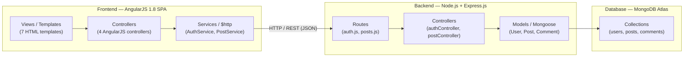
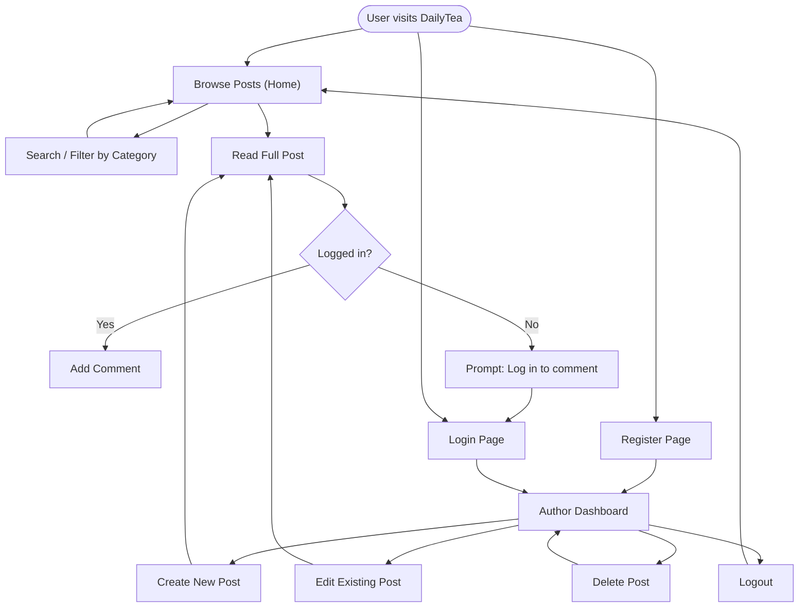
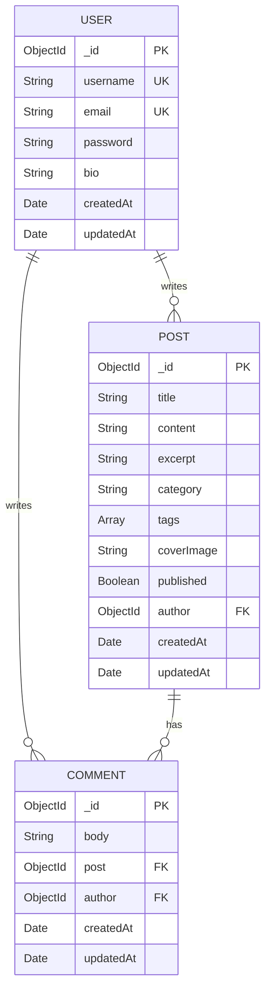
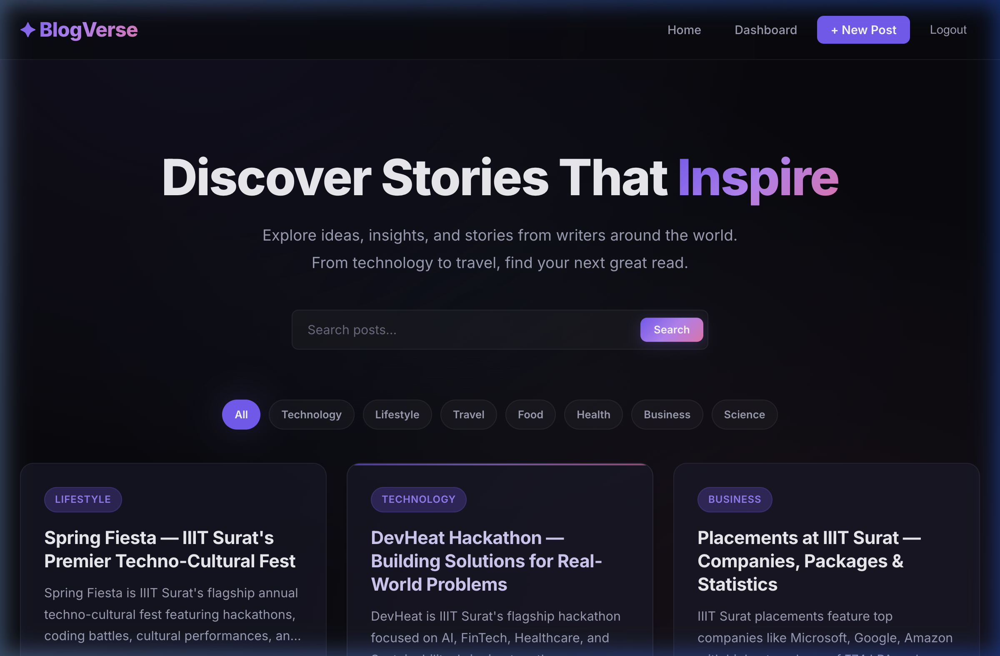
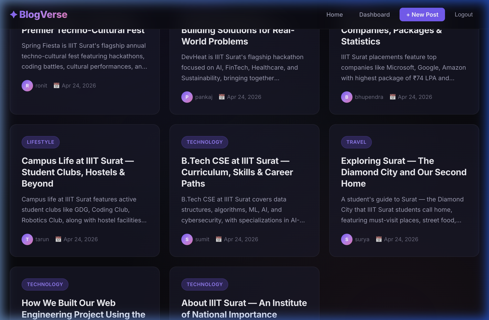
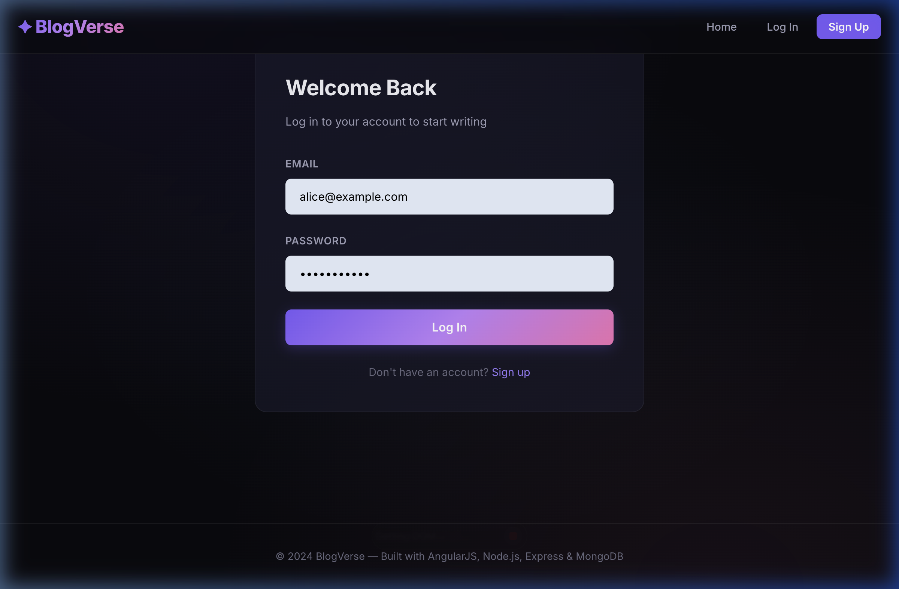
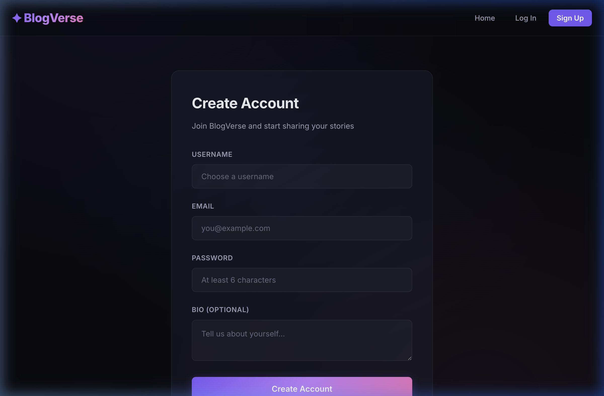
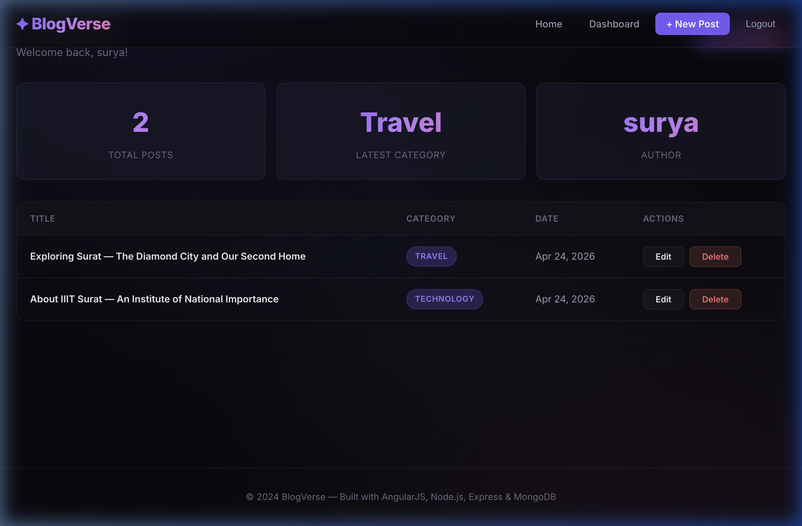
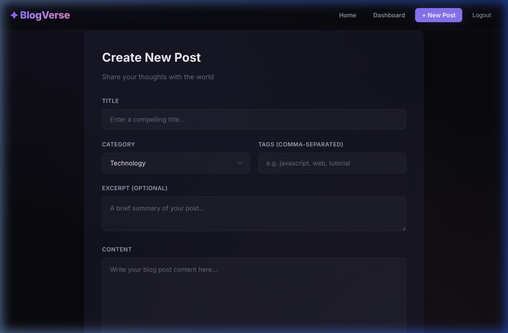
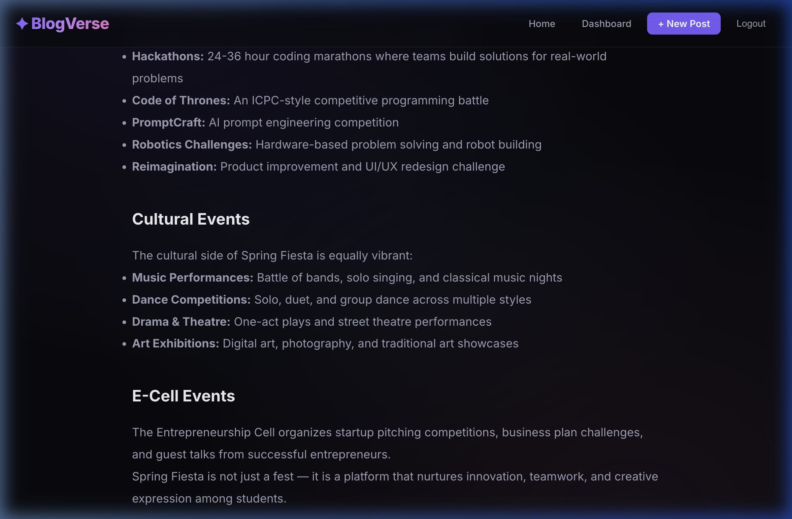

# DailyTea — Blog Website Project Report

**Subject:** Web Engineering  
**Technology Stack:** AngularJS 1.8 · Node.js · Express.js · MongoDB Atlas  
**Project Type:** Dynamic Web-Based Blog Application  

---

## 1. Problem Statement

### Problem
In today's digital age, individuals and organizations need an accessible platform to publish, share, and discuss written content. Existing blogging platforms are either overly complex with unnecessary features, proprietary with limited control, or lack modern user experience design. There is a need for a lightweight, full-stack blog platform that enables authors to create, manage, and share blog posts while allowing readers to browse content and engage through comments.

### Why This System Is Needed
- **Content Publishing**: Authors need a simple interface to create, edit, and delete blog posts with category organization and tagging.
- **Reader Engagement**: Readers need the ability to browse posts by category, search for content, and leave comments.
- **User Authentication**: The platform must support secure user registration and login to protect authoring capabilities while keeping reading public.
- **Modern Architecture**: The system demonstrates key web engineering principles including RESTful API design, client-server architecture, MVC pattern, and asynchronous programming.
- **Educational Value**: The project showcases the complete MEAN stack (MongoDB, Express.js, AngularJS, Node.js) as a practical demonstration of web engineering concepts.

---

## 2. System Architecture

### Architecture Diagram



### Architecture Description

The DailyTea application follows a **three-tier client-server architecture** with clear separation of concerns:

| Layer | Technology | Role |
|-------|-----------|------|
| **Presentation** (Frontend) | AngularJS 1.8 via CDN | Single Page Application (SPA) with two-way data binding, client-side routing via `ngRoute`, and template-based views |
| **Application** (Backend) | Node.js + Express.js | RESTful API server handling business logic, JWT-based authentication, input validation, and error handling |
| **Data** (Database) | MongoDB Atlas + Mongoose | Cloud-hosted document database storing users, posts, and comments with schema validation via Mongoose ODM |

### Key Architectural Patterns

1. **MVC (Model-View-Controller)**: 
   - **Models**: Mongoose schemas (User, Post, Comment) define data structure and validation
   - **Views**: AngularJS HTML templates render the UI dynamically
   - **Controllers**: Both Express.js controllers (server-side business logic) and AngularJS controllers (client-side presentation logic)

2. **RESTful API Design**: All data operations use standard HTTP methods (GET, POST, PUT, DELETE) with resource-based URIs

3. **Client-Server Architecture**: Complete separation between the AngularJS frontend (served as static files) and the Express.js backend API

4. **Asynchronous Programming**: All database operations use `async/await` with comprehensive `try/catch` error handling

5. **JWT Stateless Authentication**: JSON Web Tokens enable stateless authentication without server-side sessions

---

## 3. URI Design / User Flow Diagram

### Frontend Routes (AngularJS `ngRoute`)

| Route | View | Controller | Auth Required | Description |
|-------|------|------------|---------------|-------------|
| `#!/` | home.html | HomeController | No | Landing page with post listing, search, and category filter |
| `#!/login` | login.html | AuthController | No | User login form |
| `#!/register` | register.html | AuthController | No | User registration form |
| `#!/posts/:id` | post-detail.html | PostController | No | Full post view with comments |
| `#!/dashboard` | dashboard.html | DashboardController | Yes | Author's post management panel |
| `#!/create` | create-post.html | DashboardController | Yes | New post creation form |
| `#!/edit/:id` | edit-post.html | DashboardController | Yes | Edit an existing post |

### Backend API Routes

| URI | Description |
|-----|-------------|
| `/api/auth/register` | User registration |
| `/api/auth/login` | User authentication |
| `/api/auth/me` | Current user profile |
| `/api/posts` | Post listing and creation |
| `/api/posts/my/posts` | Logged-in user's posts |
| `/api/posts/:id` | Single post operations |
| `/api/posts/:id/comments` | Comment on a post |
| `/api/posts/:id/comments/:commentId` | Delete a specific comment |

### User Flow Diagram



---

## 4. Database Design

### ER Diagram



### Collections Description

**1. Users Collection**
| Field | Type | Constraints | Description |
|-------|------|-------------|-------------|
| `_id` | ObjectId | Primary Key | Auto-generated unique ID |
| `username` | String | Required, Unique, 3-30 chars | Display name |
| `email` | String | Required, Unique, Valid format | Login identifier |
| `password` | String | Required, Min 6 chars, Hashed | Bcrypt-hashed password |
| `bio` | String | Optional, Max 500 chars | Author biography |
| `createdAt` | Date | Auto-generated | Account creation timestamp |
| `updatedAt` | Date | Auto-generated | Last update timestamp |

**2. Posts Collection**
| Field | Type | Constraints | Description |
|-------|------|-------------|-------------|
| `_id` | ObjectId | Primary Key | Auto-generated unique ID |
| `title` | String | Required, Max 200 chars | Post title |
| `content` | String | Required | Full post content |
| `excerpt` | String | Optional, Max 500 chars, Auto-generated | Short preview |
| `category` | String | Required, Enum | Category classification |
| `tags` | [String] | Optional | Array of keyword tags |
| `coverImage` | String | Optional | URL for cover image |
| `published` | Boolean | Default: true | Publication status |
| `author` | ObjectId | Required, FK → Users | Post author reference |
| `createdAt` | Date | Auto-generated | Creation timestamp |
| `updatedAt` | Date | Auto-generated | Last update timestamp |

**Categories Enum:** Technology, Lifestyle, Travel, Food, Health, Business, Science, Other

**3. Comments Collection**
| Field | Type | Constraints | Description |
|-------|------|-------------|-------------|
| `_id` | ObjectId | Primary Key | Auto-generated unique ID |
| `body` | String | Required, Max 2000 chars | Comment text |
| `post` | ObjectId | Required, FK → Posts | Associated post |
| `author` | ObjectId | Required, FK → Users | Comment author |
| `createdAt` | Date | Auto-generated | Creation timestamp |
| `updatedAt` | Date | Auto-generated | Last update timestamp |

### Relationships
- **One-to-Many**: A User can write many Posts (author → posts)
- **One-to-Many**: A User can write many Comments (author → comments)
- **One-to-Many**: A Post can have many Comments (post → comments)
- When a Post is deleted, all associated Comments are also deleted (cascade delete)

---

## 5. REST API Endpoints

The system implements **11 RESTful API endpoints** (exceeding the minimum requirement of 5):

### Authentication Endpoints

| # | Method | URI | Description | Auth | Request Body | Response |
|---|--------|-----|-------------|------|-------------|----------|
| 1 | `POST` | `/api/auth/register` | Register a new user | No | `{ username, email, password, bio }` | `{ success, data: { user, token } }` |
| 2 | `POST` | `/api/auth/login` | Log in and receive JWT | No | `{ email, password }` | `{ success, data: { user, token } }` |
| 3 | `GET` | `/api/auth/me` | Get current user profile | Yes | — | `{ success, data: user }` |

### Post CRUD Endpoints

| # | Method | URI | Description | Auth | Request Body | Response |
|---|--------|-----|-------------|------|-------------|----------|
| 4 | `GET` | `/api/posts` | List all posts (with pagination, search, category filter) | No | Query: `?category=&search=&page=&limit=` | `{ success, data: [posts], pagination }` |
| 5 | `GET` | `/api/posts/:id` | Get single post with comments | No | — | `{ success, data: { post, comments } }` |
| 6 | `POST` | `/api/posts` | Create a new post | Yes | `{ title, content, excerpt, category, tags }` | `{ success, data: post }` |
| 7 | `PUT` | `/api/posts/:id` | Update a post (author only) | Yes | `{ title, content, excerpt, category, tags }` | `{ success, data: post }` |
| 8 | `DELETE` | `/api/posts/:id` | Delete post and comments (author only) | Yes | — | `{ success, message }` |
| 9 | `GET` | `/api/posts/my/posts` | Get logged-in user's posts | Yes | — | `{ success, data: [posts] }` |

### Comment Endpoints

| # | Method | URI | Description | Auth | Request Body | Response |
|---|--------|-----|-------------|------|-------------|----------|
| 10 | `POST` | `/api/posts/:id/comments` | Add comment to a post | Yes | `{ body }` | `{ success, data: comment }` |
| 11 | `DELETE` | `/api/posts/:id/comments/:commentId` | Delete a comment (author only) | Yes | — | `{ success, message }` |

### CRUD Operations Mapping
- **Create**: Endpoints #1, #6, #10 (Register user, Create post, Add comment)
- **Read**: Endpoints #3, #4, #5, #9 (Get profile, List posts, Get post, My posts)
- **Update**: Endpoint #7 (Update post)
- **Delete**: Endpoints #8, #11 (Delete post, Delete comment)

### Error Handling
All endpoints implement comprehensive error handling:
- `400` — Validation errors (missing fields, invalid data)
- `401` — Authentication errors (no token, expired token)
- `403` — Authorization errors (not the author of a post/comment)
- `404` — Resource not found (invalid post/comment ID)
- `500` — Server errors (database connection issues)

---

## 6. Screenshots

### 6.1 Home Page
The landing page features a hero section, search bar, category filter chips, and a responsive grid of blog post cards.



### 6.2 Blog Post Cards
Posts are displayed in a responsive card grid showing title, category badge, excerpt, author avatar, and date.



### 6.3 Login Page
Clean login form with email and password fields, gradient button, and link to registration.



### 6.4 Registration Page
Registration form with username, email, password, and optional bio fields.



### 6.5 Author Dashboard
After login, authors see their stats (total posts, latest category, username), and a table of their posts with edit/delete actions.



### 6.6 Create Post Page
Rich post creation form with title, category dropdown, tags, excerpt, and content fields.



### 6.7 Post Detail with Comments
Full post view with formatted content (headers, lists, paragraphs), comment section with add/delete functionality.



---

## 7. Conclusion

### Summary
DailyTea is a complete, full-stack blog application that demonstrates core Web Engineering principles using the MEAN stack. The system provides a fully functional platform where users can register, authenticate, create and manage blog posts, browse content by category or search, and engage through comments.

### Key Achievements

| Requirement | Implementation |
|-------------|---------------|
| **User Interface (AngularJS)** | ✅ 7 view templates, 4 controllers, 2 services, client-side routing |
| **REST API Backend** | ✅ Express.js with 11 RESTful endpoints |
| **Database Integration** | ✅ MongoDB Atlas with 3 Mongoose models |
| **At Least 5 API Endpoints** | ✅ 11 endpoints (exceeds requirement by 120%) |
| **CRUD Operations** | ✅ Full Create, Read, Update, Delete for posts and comments |
| **Error Handling** | ✅ Comprehensive try/catch with proper HTTP status codes |

### Web Engineering Concepts Demonstrated

1. **HTTP Protocol**: RESTful communication using standard HTTP methods (GET, POST, PUT, DELETE) with proper status codes
2. **Client-Server Architecture**: Complete separation between AngularJS SPA frontend and Express.js API backend
3. **MVC Design Pattern**: Clear Model-View-Controller structure on both frontend (AngularJS) and backend (Express)
4. **Asynchronous Programming**: All server-side operations use async/await with Promises for non-blocking I/O
5. **JWT Authentication**: Stateless token-based authentication with HTTP interceptors
6. **RESTful API Design**: Resource-oriented URIs with consistent JSON response format
7. **Database Integration**: MongoDB Atlas cloud database with Mongoose ODM for schema validation

### Benefits
- **Scalable Architecture**: Cloud-hosted MongoDB Atlas with modular Express.js backend
- **Modern UX**: Premium dark-mode UI with glassmorphism, gradients, and smooth animations
- **Secure**: Password hashing (bcrypt), JWT authentication, authorization checks
- **Responsive**: Works seamlessly across desktop and mobile devices
- **Maintainable**: Clean code separation following MVC patterns with comprehensive documentation

---

## Project Structure

```
wekaproject/
├── server/
│   ├── server.js              # Express app entry point
│   ├── config/
│   │   └── db.js              # MongoDB Atlas connection
│   ├── middleware/
│   │   └── auth.js            # JWT verification middleware
│   ├── models/
│   │   ├── User.js            # Mongoose User schema
│   │   ├── Post.js            # Mongoose Post schema
│   │   └── Comment.js         # Mongoose Comment schema
│   ├── routes/
│   │   ├── auth.js            # /api/auth routes
│   │   └── posts.js           # /api/posts routes
│   ├── controllers/
│   │   ├── authController.js  # Register/login logic
│   │   └── postController.js  # CRUD logic for posts & comments
│   └── seed.js                # Database seeder script
├── client/
│   ├── index.html             # SPA shell (loads AngularJS)
│   ├── css/
│   │   └── style.css          # Premium dark-mode design system
│   ├── app.js                 # AngularJS module + routing config
│   ├── services/
│   │   ├── authService.js     # Auth API + token management
│   │   └── postService.js     # Post/Comment API calls
│   ├── controllers/
│   │   ├── homeController.js
│   │   ├── authController.js
│   │   ├── postController.js
│   │   └── dashboardController.js
│   └── views/
│       ├── home.html
│       ├── login.html
│       ├── register.html
│       ├── post-detail.html
│       ├── dashboard.html
│       ├── create-post.html
│       └── edit-post.html
├── package.json
├── .env                       # Environment variables
├── .gitignore
└── README.md
```

---

## Technologies Used

| Technology | Version | Purpose |
|-----------|---------|---------|
| Node.js | 18+ | Server-side JavaScript runtime |
| Express.js | 4.21.x | Web application framework |
| AngularJS | 1.8.3 | Frontend SPA framework (via CDN) |
| MongoDB Atlas | Cloud | Document database (NoSQL) |
| Mongoose | 8.9.x | MongoDB ODM |
| bcryptjs | 2.4.x | Password hashing |
| JSON Web Tokens | 9.0.x | Stateless authentication |
| CORS | 2.8.x | Cross-origin resource sharing |
| dotenv | 16.4.x | Environment variable management |
